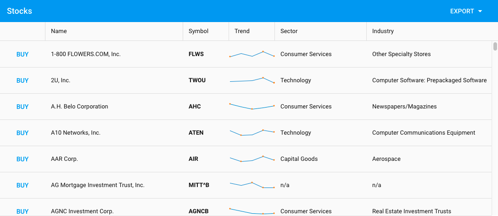

# ExtReact Grid Tech Talk

This is the code shown during tech talk entitled "Learn How to Use the ExtReact Grid with React Apps" on June 22, 2017.



## Running

If you have not already, log into Sencha's NPM registry using your trial or support portal credentials:

```
npm login --registry=http://npm.sencha.com --scope=@extjs
```

If you do not have credentials, you can get them by [signing up for a trial of ExtReact](http://sencha.com/extreact).

Then, run the following to build and launch the app:

```
git clone https://github.com/sencha/ext-react-grid-techtalk.git
npm install
npm start
```

You can view the app by pointing your browser to [http://localhost:8080](http://localhost:8080)

## Tags

This repo uses tags corresponding to the steps in the tech talk:

| Tag | Description |
| --- | ----------- |
| step-1 | Basic scaffolding |
| step-2 | Basic Grid with store and columns |
| step-3 | The "Buy" button |
| step-4 | The trends sparkline chart |
| step-5 | Exporting to Excel and CSV |
| step-6 | Cell editing |
| step-7 | Row editing on phones and tablets |
